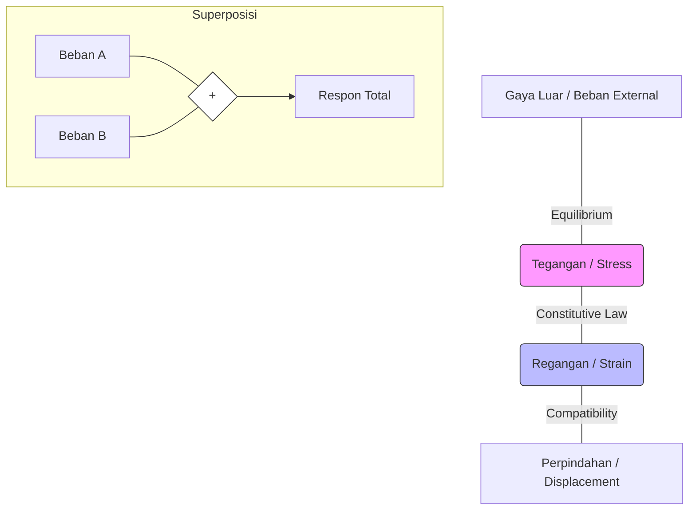
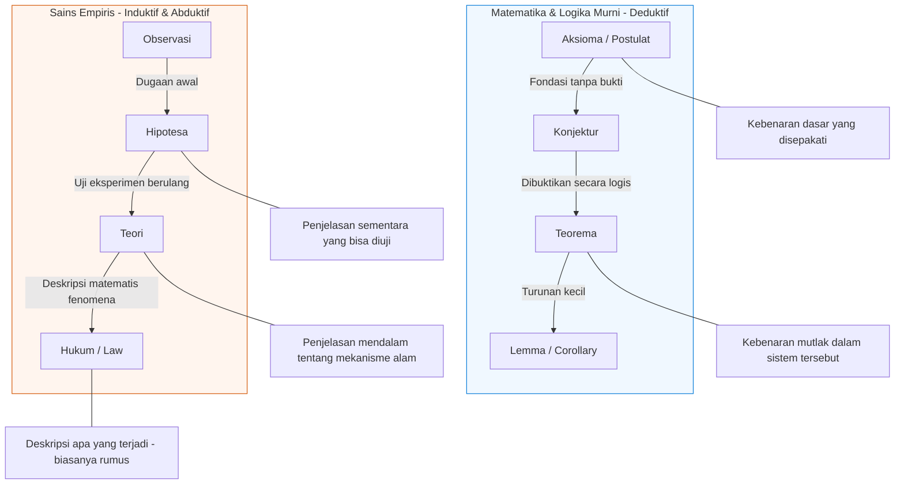
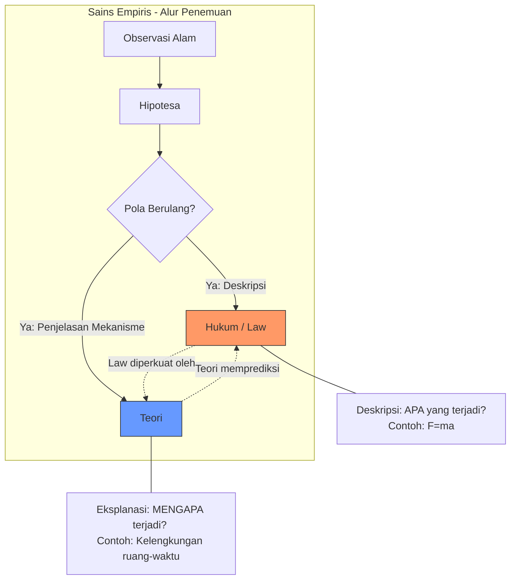
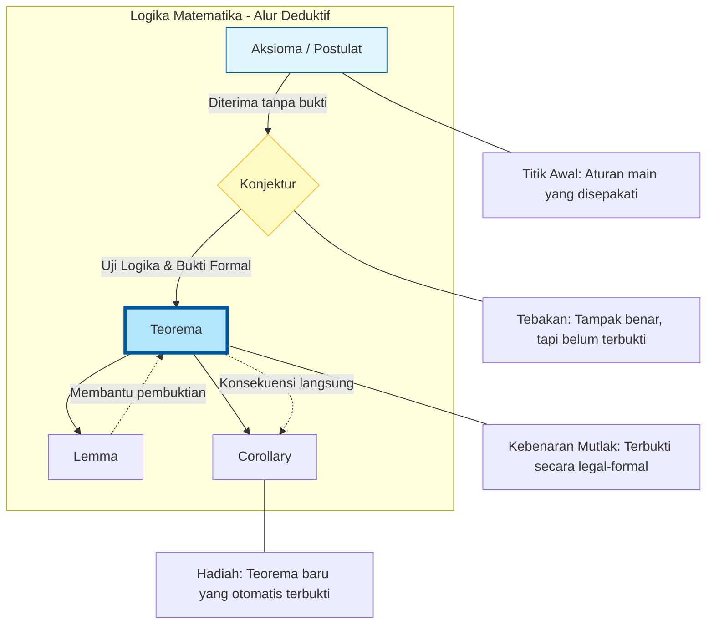

# buku-01-mang-ugi
Komentar setelah membaca buku mang ugi
> [!TIP] h3, pp11
> Saya sering mengingat ada 3 (tiga) hal mendasar bernama euqilibrium dan kompatibilitas. Ternyata yang ketiga-nya teringatkan kembali setelah membaca ini, yaitu *constitutive law*. Terima kasih sudah mengingatkan.

> [!NOTE] Catatan LKO
> Ini kalau menurut LKO, perlu dijelaskan juga terkait perbedaan teori dan teorema yang hubungannya dengan validasi kebenaran. Ini menurut saya bisa menjelaskan terkait hubungan satu sama lain dan harapannya adalah bisa memetakan puzzle yang ada.

law dalam susunan science empiris, dari hipotesa ke law (apa yg terjadi), hipotesa ke teori (penjelasan mengapa terjadi).

postulat atau di math disebut aksioma.

saya kayaknya bakal bikin model, cartesian, sejarah orangnya

bahas mafikibi, bahwa math menjadi fundamental language

hal16, 3 persamaan dasar, banyak 7unknown variable harus aama dengan banyak equation

h20, kosong adalah isi, isi adalah kosong. richard feynman

model adalah percobaan replikasi bentuk nyata ke dalam bentuk matematis, dengN batasan tertentu utk bs memprediksi

> [!message] 20260209 Joplin to obsidian
> Dari joplin, saya pindah ke obsidian untuk editing.
